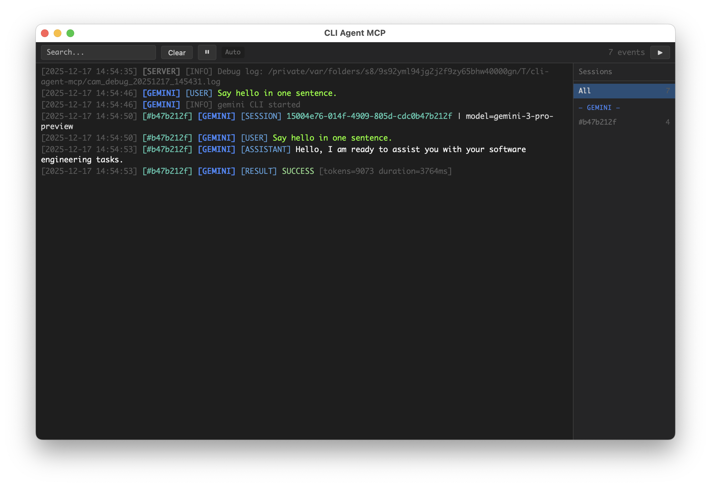

# cli-agent-mcp

[中文文档](README_zh.md)

Unified MCP (Model Context Protocol) server for CLI AI agents. Provides a single interface to invoke Codex, Gemini, Claude, OpenCode CLI tools, and Nano Banana Pro image generation.

## Why cli-agent-mcp?

This is more than a CLI wrapper — it's an **orchestration pattern** for multi-model collaboration.

**Can't articulate your requirements clearly?** Let Claude orchestrate. Describe what you want, and it will decompose your vague idea into concrete tasks for the right agent. The act of delegation forces clarity.

**Planning a grand product vision?** Each model brings a unique lens:
- **Codex**: The critic. Its analytical eye catches what you missed, challenges assumptions, finds edge cases.
- **Gemini**: The creative. Divergent thinking, unexpected connections, the spark you didn't know you needed.
- **Claude**: The scribe. Faithful execution, clear documentation, turning ideas into working code.
- **Banana**: The artist. High-fidelity image generation for UI mockups, product visuals, and creative assets.

**Want persistent results?** Use `save_file` to capture agent outputs, then let Claude synthesize insights across multiple analyses.

We don't just wrap CLIs — we provide a **thinking framework** for human-AI collaboration.

## Features

- **Unified Interface**: Single MCP server exposing multiple CLI agents
- **GUI Dashboard**: Real-time task monitoring with pywebview
- **Request Isolation**: Per-request execution context for safe concurrent usage
- **Signal Handling**: Graceful cancellation via SIGINT without killing the server
- **Debug Logging**: Comprehensive subprocess output capture for debugging

## Screenshot



## Installation

```bash
# Install from PyPI (when published)
uvx cli-agent-mcp

# Install from GitHub
uvx --from git+https://github.com/shiharuharu/cli-agent-mcp.git cli-agent-mcp

# Install from source (editable mode for development)
uvx --from /path/to/cli-agent-mcp cli-agent-mcp

# Or use pip
pip install -e .
```

## Configuration

Configure via environment variables:

| Variable | Description | Default |
|----------|-------------|---------|
| `CAM_ENABLE` | Comma-separated list of enabled tools (empty = all) | `""` (all) |
| `CAM_DISABLE` | Comma-separated list of disabled tools (subtracted from enable) | `""` |
| `CAM_GUI` | Enable GUI dashboard | `true` |
| `CAM_GUI_DETAIL` | GUI detail mode | `false` |
| `CAM_GUI_KEEP` | Keep GUI on exit | `false` |
| `CAM_DEBUG` | Include debug info in MCP responses | `false` |
| `CAM_LOG_DEBUG` | Write debug logs to temp file | `false` |
| `CAM_SIGINT_MODE` | SIGINT handling (`cancel`/`exit`/`cancel_then_exit`) | `cancel` |
| `CAM_SIGINT_DOUBLE_TAP_WINDOW` | Double-tap exit window (seconds) | `1.0` |

## Tools

### codex

Invoke OpenAI Codex CLI agent for deep code analysis and critical review.

**Best for**: Code review, bug hunting, security analysis

| Parameter | Type | Required | Default | Description |
|-----------|------|----------|---------|-------------|
| `prompt` | string | ✓ | - | Task instruction for the agent |
| `workspace` | string | ✓ | - | Absolute path to the project directory |
| `continuation_id` | string | | `""` | Pass from previous response to continue conversation |
| `permission` | string | | `read-only` | Permission level: `read-only`, `workspace-write`, `unlimited` |
| `model` | string | | `""` | Model override (only specify if explicitly requested) |
| `save_file` | string | | `""` | PREFERRED for large outputs. Writes directly to file, avoiding context overflow |
| `report_mode` | boolean | | `false` | Generate standalone report format |
| `save_file_with_wrapper` | boolean | | `false` | Wrap output with `<agent-output>` XML tags |
| `save_file_with_append_mode` | boolean | | `false` | Append to file instead of overwriting |
| `verbose_output` | boolean | | `false` | Return detailed output including reasoning |
| `context_paths` | array | | `[]` | Reference file/directory paths to provide context |
| `image` | array | | `[]` | Absolute paths to image files for visual context |
| `task_note` | string | | `""` | Display label for GUI |
| `debug` | boolean | | (global) | Override debug setting for this call |

### gemini

Invoke Google Gemini CLI agent for UI design and comprehensive analysis.

**Best for**: UI mockups, image analysis, requirement discovery, full-text analysis

| Parameter | Type | Required | Default | Description |
|-----------|------|----------|---------|-------------|
| `prompt` | string | ✓ | - | Task instruction for the agent |
| `workspace` | string | ✓ | - | Absolute path to the project directory |
| `continuation_id` | string | | `""` | Pass from previous response to continue conversation |
| `permission` | string | | `read-only` | Permission level: `read-only`, `workspace-write`, `unlimited` |
| `model` | string | | `""` | Model override |
| `save_file` | string | | `""` | PREFERRED for large outputs. Writes directly to file, avoiding context overflow |
| `report_mode` | boolean | | `false` | Generate standalone report format |
| `save_file_with_wrapper` | boolean | | `false` | Wrap output with `<agent-output>` XML tags |
| `save_file_with_append_mode` | boolean | | `false` | Append to file instead of overwriting |
| `verbose_output` | boolean | | `false` | Return detailed output including reasoning |
| `context_paths` | array | | `[]` | Reference file/directory paths to provide context |
| `task_note` | string | | `""` | Display label for GUI |
| `debug` | boolean | | (global) | Override debug setting for this call |

### claude

Invoke Anthropic Claude CLI agent for code implementation.

**Best for**: Feature implementation, refactoring, code generation

| Parameter | Type | Required | Default | Description |
|-----------|------|----------|---------|-------------|
| `prompt` | string | ✓ | - | Task instruction for the agent |
| `workspace` | string | ✓ | - | Absolute path to the project directory |
| `continuation_id` | string | | `""` | Pass from previous response to continue conversation |
| `permission` | string | | `read-only` | Permission level: `read-only`, `workspace-write`, `unlimited` |
| `model` | string | | `""` | Model override (`sonnet`, `opus`, or full model name) |
| `save_file` | string | | `""` | PREFERRED for large outputs. Writes directly to file, avoiding context overflow |
| `report_mode` | boolean | | `false` | Generate standalone report format |
| `save_file_with_wrapper` | boolean | | `false` | Wrap output with `<agent-output>` XML tags |
| `save_file_with_append_mode` | boolean | | `false` | Append to file instead of overwriting |
| `verbose_output` | boolean | | `false` | Return detailed output including reasoning |
| `context_paths` | array | | `[]` | Reference file/directory paths to provide context |
| `system_prompt` | string | | `""` | Complete replacement for the default system prompt |
| `append_system_prompt` | string | | `""` | Additional instructions appended to default prompt |
| `agent` | string | | `""` | Specify agent name (overrides default agent setting) |
| `task_note` | string | | `""` | Display label for GUI |
| `debug` | boolean | | (global) | Override debug setting for this call |

### opencode

Invoke OpenCode CLI agent for full-stack development.

**Best for**: Rapid prototyping, multi-framework projects

| Parameter | Type | Required | Default | Description |
|-----------|------|----------|---------|-------------|
| `prompt` | string | ✓ | - | Task instruction for the agent |
| `workspace` | string | ✓ | - | Absolute path to the project directory |
| `continuation_id` | string | | `""` | Pass from previous response to continue conversation |
| `permission` | string | | `read-only` | Permission level: `read-only`, `workspace-write`, `unlimited` |
| `model` | string | | `""` | Model override (format: `provider/model`) |
| `save_file` | string | | `""` | PREFERRED for large outputs. Writes directly to file, avoiding context overflow |
| `report_mode` | boolean | | `false` | Generate standalone report format |
| `save_file_with_wrapper` | boolean | | `false` | Wrap output with `<agent-output>` XML tags |
| `save_file_with_append_mode` | boolean | | `false` | Append to file instead of overwriting |
| `verbose_output` | boolean | | `false` | Return detailed output including reasoning |
| `context_paths` | array | | `[]` | Reference file/directory paths to provide context |
| `file` | array | | `[]` | Absolute paths to files to attach |
| `agent` | string | | `build` | Agent type: `build`, `plan`, etc. |
| `task_note` | string | | `""` | Display label for GUI |
| `debug` | boolean | | (global) | Override debug setting for this call |

### banana

Generate high-fidelity images via the Nano Banana Pro API.

**Best for**: UI mockups, product visuals, infographics, architectural renders, character art

Nano Banana Pro has exceptional understanding and visual expression capabilities—your prompt creativity is the only limit, not the model.

| Parameter | Type | Required | Default | Description |
|-----------|------|----------|---------|-------------|
| `prompt` | string | ✓ | - | Image generation prompt |
| `save_path` | string | ✓ | - | Base directory for saving images |
| `task_note` | string | ✓ | - | Subdirectory name (English recommended, e.g., 'hero-banner'). Files saved to `{save_path}/{task_note}/` |
| `images` | array | | `[]` | Reference images (absolute paths) with optional role and label |
| `aspect_ratio` | string | | `"1:1"` | Image aspect ratio: `1:1`, `2:3`, `3:2`, `3:4`, `4:3`, `4:5`, `5:4`, `9:16`, `16:9`, `21:9` |
| `resolution` | string | | `"1K"` | Image resolution: `1K`, `2K`, `4K` |
| `include_thoughts` | boolean | | `false` | Include thinking process in response |

**Environment Variables:**

| Variable | Required | Default | Description |
|----------|----------|---------|-------------|
| `BANANA_AUTH_TOKEN` | ✓ | - | Google API key or Bearer token |
| `BANANA_ENDPOINT` | | `https://generativelanguage.googleapis.com` | API endpoint (version path auto-appended) |

**Prompt Best Practices:**
- Explicitly request an image (e.g., start with "Generate an image:" or include `"output":"image"`)
- Use structured specs (JSON / XML tags / labeled sections) for complex requests
- Use `MUST/STRICT/CRITICAL` for non-negotiable constraints
- Add negative constraints (e.g., "no watermark", "no distorted hands")

### image

Generate images via OpenRouter-compatible or OpenAI-compatible endpoints.

**Best for**: General image generation when you need compatibility with various providers. For best results with Gemini models, use the `banana` tool instead.

| Parameter | Type | Required | Default | Description |
|-----------|------|----------|---------|-------------|
| `prompt` | string | ✓ | - | Image generation prompt |
| `save_path` | string | ✓ | - | Base directory for saving images |
| `task_note` | string | ✓ | - | Subdirectory name (English recommended, e.g., 'hero-banner'). Files saved to `{save_path}/{task_note}/` |
| `images` | array | | `[]` | Reference images (absolute paths) with optional role and label |
| `aspect_ratio` | string | | `"1:1"` | Image aspect ratio: `1:1`, `2:3`, `3:2`, `3:4`, `4:3`, `4:5`, `5:4`, `9:16`, `16:9`, `21:9` |
| `resolution` | string | | `"1K"` | Image resolution: `1K`, `2K`, `4K` |
| `model` | string | | (env) | Model to use for generation |
| `api_type` | string | | (env) | API type: `openrouter_chat`, `openai_images`, `openai_responses` |

**Environment Variables:**

| Variable | Required | Default | Description |
|----------|----------|---------|-------------|
| `IMAGE_AUTH_TOKEN` | ✓ | - | API key for image generation |
| `IMAGE_ENDPOINT` | | `https://openrouter.ai/api` | API endpoint (version path auto-appended) |
| `IMAGE_MODEL` | | `gpt-image-1` | Default model |
| `IMAGE_API_TYPE` | | `openrouter_chat` | API type: `openrouter_chat`, `openai_images`, `openai_responses` |

### get_gui_url

Get the GUI dashboard URL. Returns the HTTP URL where the live event viewer is accessible.

No parameters required.

## Prompt Injection

Some parameters automatically inject additional content into the prompt using `<mcp-injection>` XML tags. These tags make it easy to debug and identify system-injected content.

### `report_mode`

When `save_file` and `report_mode` are both set, output format requirements are injected:

```xml
<your prompt>

<mcp-injection type="output-format">
  <output-requirements>
    <rule>This response will be saved as a standalone document.</rule>
    <rule>Write so it can be understood WITHOUT any prior conversation context.</rule>
    <rule>Do NOT reference "above", "previous messages", or "as discussed".</rule>
    <rule>Use the same language as the user's request.</rule>
  </output-requirements>
  <structure>
    <section name="Summary">3-7 bullet points with key findings and conclusions</section>
    <section name="Context">Restate the task/problem so readers understand without chat history</section>
    <section name="Analysis">Step-by-step reasoning with evidence; include file:line references</section>
    <section name="Recommendations">Actionable next steps ordered by priority</section>
  </structure>
  <note>Write with enough detail to be useful standalone, but avoid unnecessary filler.</note>
</mcp-injection>
```

### `context_paths`

When `context_paths` is provided, reference paths are injected:

```xml
<your prompt>

<mcp-injection type="reference-paths">
  <description>
    These paths are provided as reference for project structure.
    You may use them to understand naming conventions and file organization.
  </description>
  <paths>
    <path>/src/api/handlers.py</path>
    <path>/config/settings.json</path>
  </paths>
</mcp-injection>
```

## Stateless Design

**Important**: Each tool call is stateless - the agent has NO memory of previous calls.

- **New conversation** (no `continuation_id`): Include ALL relevant context in your prompt - background, specifics, constraints, and prior findings.
- **Continuing conversation** (with `continuation_id`): The agent retains context from that session, so you can be brief.

If your request references prior context (e.g., "fix that bug", "continue the work"), you must either:
1. Provide `continuation_id` from a previous response, OR
2. Expand the reference into concrete details

## File Output Options

### `save_file_with_wrapper`

When enabled, output is wrapped with XML tags containing metadata:

```
<agent-output agent="gemini" continuation_id="abc123">
... agent response ...
</agent-output>
```

### `save_file_with_append_mode`

When enabled, new output is appended to existing file instead of overwriting. Combined with `save_file_with_wrapper`, enables multi-agent collaboration:

```
<agent-output agent="codex" continuation_id="...">
Critical analysis of the codebase...
</agent-output>

<agent-output agent="gemini" continuation_id="...">
Creative suggestions for improvement...
</agent-output>

<agent-output agent="claude" continuation_id="...">
Implementation summary...
</agent-output>
```

## Response Format

All responses are wrapped in XML format:

### Success Response

```xml
<response>
  <thought_process>...</thought_process>  <!-- Only when verbose_output=true -->
  <answer>
    Agent's response content...
  </answer>
  <continuation_id>session-id-here</continuation_id>
  <debug_info>...</debug_info>  <!-- Only when debug=true -->
</response>
```

### Error Response

Error responses include partial progress to enable retry:

```xml
<response>
  <error>Error message</error>
  <thought_process>...</thought_process>  <!-- Collected steps before error -->
  <partial_answer>...</partial_answer>    <!-- Partial output if any -->
  <continuation_id>session-id</continuation_id>
  <hint>Task failed. Above is the output collected so far. You can send 'continue' with this continuation_id to retry.</hint>
  <debug_info>...</debug_info>
</response>
```

## Permission Levels

| Level | Description | Codex | Gemini | Claude | OpenCode | Banana |
|-------|-------------|-------|--------|--------|----------|--------|
| `read-only` | Can only read files | `--sandbox read-only` | Read-only tools only | `--tools Read,Grep,Glob` | `edit: deny, bash: deny` | Read workspace images only |
| `workspace-write` | Can modify files within workspace | `--sandbox workspace-write` | All tools + sandbox | `--tools Read,Edit,Write,Bash` | `edit: allow, bash: ask` | Write to workspace only |
| `unlimited` | Full system access (use with caution) | `--sandbox danger-full-access` | All tools, no sandbox | `--tools default` | `edit: allow, bash: allow` | Full access |

## Debug Mode

Enable debug mode to get detailed execution information:

```bash
# Enable debug info in responses
export CAM_DEBUG=true

# Enable detailed log file
export CAM_LOG_DEBUG=true
```

When `CAM_LOG_DEBUG=true`, logs are written to:
```
/tmp/cli-agent-mcp/cam_debug_YYYYMMDD_HHMMSS.log
```

Debug output includes:
- Full subprocess command
- Complete stdout/stderr output
- Return codes
- MCP request/response summaries

## MCP Configuration

Add to your MCP client configuration (e.g., Claude Desktop `claude_desktop_config.json`):

### Basic Configuration

```json
{
  "mcpServers": {
    "cli-agent-mcp": {
      "command": "uvx",
      "args": ["cli-agent-mcp"]
    }
  }
}
```

### Install from GitHub

```json
{
  "mcpServers": {
    "cli-agent-mcp": {
      "command": "uvx",
      "args": [
        "--from",
        "git+https://github.com/shiharuharu/cli-agent-mcp.git",
        "cli-agent-mcp"
      ]
    }
  }
}
```

### With Debug Mode

```json
{
  "mcpServers": {
    "cli-agent-mcp": {
      "command": "uvx",
      "args": [
        "--from",
        "git+https://github.com/shiharuharu/cli-agent-mcp.git",
        "cli-agent-mcp"
      ],
      "env": {
        "CAM_DEBUG": "true",
        "CAM_LOG_DEBUG": "true"
      }
    }
  }
}
```

### Disable GUI

```json
{
  "mcpServers": {
    "cli-agent-mcp": {
      "command": "uvx",
      "args": ["cli-agent-mcp"],
      "env": {
        "CAM_GUI": "false"
      }
    }
  }
}
```

### Limit Available Tools

```json
{
  "mcpServers": {
    "cli-agent-mcp": {
      "command": "uvx",
      "args": ["cli-agent-mcp"],
      "env": {
        "CAM_ENABLE": "claude,gemini"
      }
    }
  }
}
```

### Disable Image Tools

```json
{
  "mcpServers": {
    "cli-agent-mcp": {
      "command": "uvx",
      "args": ["cli-agent-mcp"],
      "env": {
        "CAM_DISABLE": "banana,image"
      }
    }
  }
}
```

## Project Structure

```
cli-agent-mcp/
├── src/cli_agent_mcp/       # Main package
│   ├── shared/              # Shared modules (image, invokers, parsers, gui)
│   ├── server.py
│   ├── config.py
│   └── gui_manager.py
└── tests/
```

## Development

```bash
# Install dev dependencies
pip install -e ".[dev]"

# Run tests
pytest
```

## License

MIT
